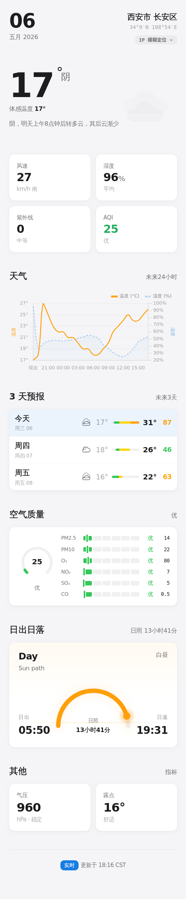
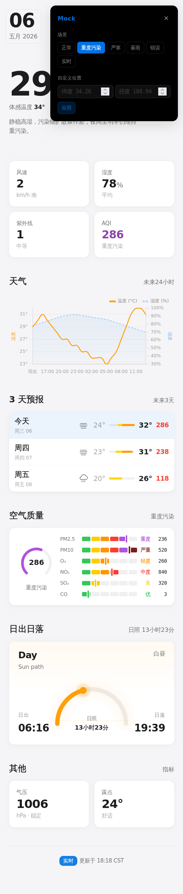

# Weather Frontend

<p align="center">
  English | <a href="docs/README.zh-CN.md">简体中文</a>
</p>

<p align="center">
  
</p>

<p align="center">
  A polished Svelte weather dashboard with GPS/IP location, AQI insight, forecast charts, and built-in mock scenarios for reliable demos.
</p>

<p align="center">
  <a href="#features">Features</a>
  ·
  <a href="#screenshots">Screenshots</a>
  ·
  <a href="#quick-start">Quick Start</a>
  ·
  <a href="#configuration">Configuration</a>
  ·
  <a href="#scripts">Scripts</a>
</p>

<p align="center">
  
  
  
  
</p>

## Features

- **Real weather data**: consume a backend weather API through `PUBLIC_WEATHER_API_BASE_URL`.
- **Smart location flow**: try browser GPS first, then fall back to IP-based location when permissions, HTTPS, or device capabilities block precise positioning.
- **China-ready coordinates**: convert browser WGS-84 coordinates to GCJ-02 before requesting weather by location.
- **Full weather overview**: current temperature, feels-like temperature, wind, humidity, pressure, visibility, UV, AQI, pollutants, sunrise, sunset, hourly humidity, and daily forecast.
- **Interactive data modes**: switch between real data and local mock scenarios without leaving the UI.
- **Mock scenario lab**: normal, heavy pollution, cold, rain, error, plus custom latitude/longitude testing.
- **Production-oriented frontend**: SvelteKit, TypeScript, Chart.js, Motion, static adapter, and Playwright e2e support.
- **Responsive visual system**: Apple-inspired typography, spacing, restrained surfaces, and mobile-first layout.

## Screenshots

| Main dashboard | Mock / heavy pollution scenario |
| --- | --- |
|  |  |

## Tech Stack

- [Svelte 5](https://svelte.dev/) with runes
- [SvelteKit](https://kit.svelte.dev/) with `@sveltejs/adapter-static`
- [Vite](https://vite.dev/) for local development and production builds
- [TypeScript](https://www.typescriptlang.org/) for typed application logic
- [Tailwind CSS 4](https://tailwindcss.com/) via the Vite plugin
- [Chart.js](https://www.chartjs.org/) and `svelte-chartjs` for weather charts
- [Motion](https://motion.dev/) for small interaction animations
- [Playwright](https://playwright.dev/) for end-to-end testing

## Quick Start

```bash
pnpm install
cp .env.example .env
pnpm dev
```

The app runs on the Vite dev server, usually at `http://localhost:5173`.

For production:

```bash
pnpm build
pnpm preview
```

## Configuration

Create a `.env` file from `.env.example` and configure the public backend endpoint:

```bash
PUBLIC_WEATHER_API_BASE_URL=https://your-api.example.com
PUBLIC_BEIAN_ENABLED=false
PUBLIC_BEIAN_TEXT=XICP备XXXXX号
```

The frontend expects the backend to expose:

- `GET /weather/comprehensive` for IP-based weather and location fallback.
- `GET /weather/by-location?latitude={lat}&longitude={lon}` for GPS/custom-coordinate weather.

Browser GPS requires a secure context. In production, serve the app over HTTPS; otherwise the app will automatically fall back to IP-based location.

## Mock Mode

The app includes a hidden mock panel for demos, QA, and API outage testing.

- Open it by double-clicking the date block in the top-left header.
- Choose a mock scenario: `normal`, `heavy-pollution`, `cold`, `rain`, or `error`.
- Enter custom latitude and longitude to request real weather for a specific location while staying in the mock workflow.
- Switch back to realtime mode from the same panel.

Mock preferences are stored in `localStorage`, so refreshes keep the selected mode and scenario.

## Project Structure

```text
frontend/
├── docs/                    # README screenshots and visual assets
├── src/
│   ├── lib/
│   │   ├── api/             # Weather API client
│   │   ├── components/      # Weather UI sections
│   │   ├── mock/            # Local mock weather scenarios
│   │   ├── stores/          # Svelte stores and data loading flow
│   │   ├── types/           # Weather API and UI data models
│   │   └── geolocation.ts   # Browser GPS + WGS-84 to GCJ-02 conversion
│   └── routes/              # SvelteKit pages and styles
├── static/                  # Static public assets
├── svelte.config.js         # Static adapter configuration
├── vite.config.ts           # Vite + SvelteKit + Tailwind setup
└── playwright.config.ts     # E2E test configuration
```

## Scripts

| Command | Description |
| --- | --- |
| `pnpm dev` | Start the local development server. |
| `pnpm build` | Build the static production bundle into `build/`. |
| `pnpm preview` | Preview the production build locally. |
| `pnpm check` | Run Svelte and TypeScript checks. |
| `pnpm test:e2e` | Run Playwright end-to-end tests. |
| `pnpm lint` | Check formatting with Prettier. |
| `pnpm format` | Format the project with Prettier. |

## Development Notes

- GPS positioning can fail on plain HTTP, denied browser permissions, or unsupported devices. The store layer handles this and falls back to IP data.
- API requests are guarded with `AbortController` and request IDs to avoid stale responses overwriting newer data.
- Static deployment is enabled through `@sveltejs/adapter-static`; host the generated `build/` directory on any static hosting platform.
- The visual direction is documented in [DESIGN.md](DESIGN.md).

## License

This project is licensed under the [MIT License](LICENSE).
